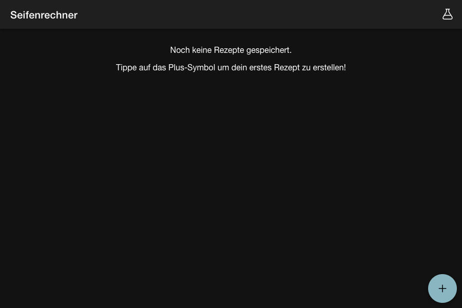

# Seifenrechner 4 🧼

Ein moderner, benutzerfreundlicher Seifenrechner als Progressive Web App (PWA). Entwickelt, um Seifensiedern bei der Berechnung ihrer Rezepte zu helfen – präzise, offline-fähig und mobiloptimiert.


*(Hier könnte ein aktueller Screenshot der Anwendung stehen)*

## 🚀 Features

*   **Rezept-Rechner**: Präzise Berechnung von NaOH, KOH und Wassermengen basierend auf ausgewählten Ölen und Fetten.
*   **Umfangreiche Öldatenbank**: Anpassbare Liste von Ölen mit ihren spezifischen Verseifungszahlen und Eigenschaften.
*   **Duft-Rechner**: Berechnung der empfohlenen Duftöl-Mengen.
*   **Rezept-Verwaltung**: Speichern und Laden von eigenen Rezepten (lokal im Browser).
*   **Offline-First (PWA)**: Funktioniert komplett ohne Internetverbindung nach dem ersten Laden. Installierbar auf dem Homescreen.
*   **Mobile Support**: Optimiert für Smartphones und Tablets, inklusive iOS Support via Capacitor.
*   **Mehrsprachigkeit**: Unterstützung für Deutsch und Englisch (i18n).
*   **Dark Mode**: Automatische Anpassung an die Systemeinstellungen.

## 🛠 Tech Stack

Dieses Projekt wurde mit modernen Web-Technologien erstellt, um Performance und Wartbarkeit zu gewährleisten:

*   **Frontend**: [React 19](https://react.dev/) mit [TypeScript](https://www.typescriptlang.org/)
*   **Build Tool**: [Vite](https://vitejs.dev/)
*   **UI Framework**: [Ionic React](https://ionicframework.com/docs/react) & CSS Variables
*   **State & Logic**: Custom Hooks
*   **Internationalisierung**: [i18next](https://www.i18next.com/)
*   **Testing**: [Vitest](https://vitest.dev/) & React Testing Library
*   **Mobile / Native**: [Capacitor](https://capacitorjs.com/) (iOS Integration)

## 🏁 Erste Schritte

Voraussetzungen: [Node.js](https://nodejs.org/) (Version 18+ empfohlen).

1.  **Repository klonen**
    ```bash
    git clone https://github.com/dein-user/seifenrechner4.git
    cd seifenrechner4
    ```

2.  **Abhängigkeiten installieren**
    ```bash
    npm install
    ```

3.  **Entwicklungsserver starten**
    ```bash
    npm run dev
    ```
    Die App ist nun unter `http://localhost:5173` erreichbar.

## 📜 Skripte

*   `npm run dev`: Startet den lokalen Entwicklungsserver.
*   `npm run build`: Erstellt die optimierte Produktions-Version im `dist/` Ordner.
*   `npm run preview`: Vorschau der Produktions-Version lokal.
*   `npm run lint`: Prüft den Code auf Fehler (ESLint).
*   `npm test` (oder `npx vitest`): Führt die Unit-Tests aus.

## 📱 Mobile Entwicklung (iOS)

Das Projekt nutzt Capacitor, um native Apps zu generieren.

```bash
# Projekt bauen
npm run build

# Änderungen mit dem iOS-Projekt synchronisieren
npx cap sync ios

# iOS Projekt in Xcode öffnen
npx cap open ios
```

## 🌍 Hosting

Da es sich um eine statische Single Page Application (SPA) handelt, kann das Projekt einfach auf Plattformen wie **Vercel**, **Netlify** oder **GitHub Pages** gehostet werden.

Für PWA-Funktionalität (Service Worker) ist **HTTPS** zwingend erforderlich.

## 📄 Lizenz

Dieses Projekt ist unter der MIT Lizenz veröffentlicht.
