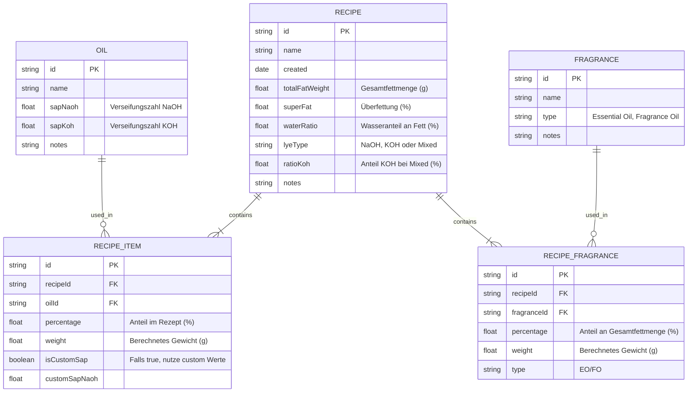

# Architektur & Design: Seifenrechner

## Datenmodell (Entity Relationship)



## App Flow & UI Struktur

```mermaid
graph TD
    User((User))
    
    subgraph UI [Ionic React App]
        Home[Home / Dashboard]
        Calc[Rechner / Editor]
        RecipeList[Rezept Liste]
        OilList[Öl Verwaltung]
        Settings[Einstellungen]
    end

    subgraph Logic [Business Logic]
        Calculator[SoapCalculator Engine]
        Validator[Recipe Validator]
    end

    subgraph Data [Persistence]
        Store[LocalStorage / Ionic Storage]
        Exporter[JSON Export/Import]
    end

    User --> Home
    Home --> Calc
    Home --> RecipeList
    Home --> OilList
    
    Calc --> Calculator
    Calculator --> Validator
    Calc --> Store : Save/Load
    
    RecipeList --> Calc : Edit
    OilList --> Store : Manage Defaults
    
    Settings --> Exporter
```

## Berechnungslogik (Beispiel)

1. **Input**: Gesamtfett 1000g.
2. **Rezept-Position**: Olivenöl 50%. -> Gewicht = 500g.
3. **Lauge (Brutto)**: 500g * 0.134 (SAP NaOH) = 67g NaOH.
4. **Überfettung**: 500g * 0.134 * (1 - 0.05 Überfettung) = 63.65g NaOH (Netto).
5. **Wasser**: 1000g * 0.30 (30%) = 300g.
6. **Duftöl**: 1000g * 0.03 (3%) = 30g.
7. **Warnung**: Wenn Summe der Öl-Prozente != 100%.

## Tech Stack Details

*   **Framework**: React 18+ (Hooks)
*   **UI Library**: Ionic Framework 8 (Components: IonGrid, IonInput, IonSelect, IonModal)
*   **Build Tool**: Vite
*   **State Management**: React Context oder Zustand (einfach & leichtgewichtig)
*   **Validation**: Zod (optional) oder einfache Custom Hooks
*   **Persistence**: `@capacitor/preferences` (früher Storage) oder einfaches `localStorage` wrapper für PWA. Für Native-Feeling später Capacitor Filesystem möglich. Wir starten mit LocalStorage/IndexedDB via einer Abstraktionsschicht.
