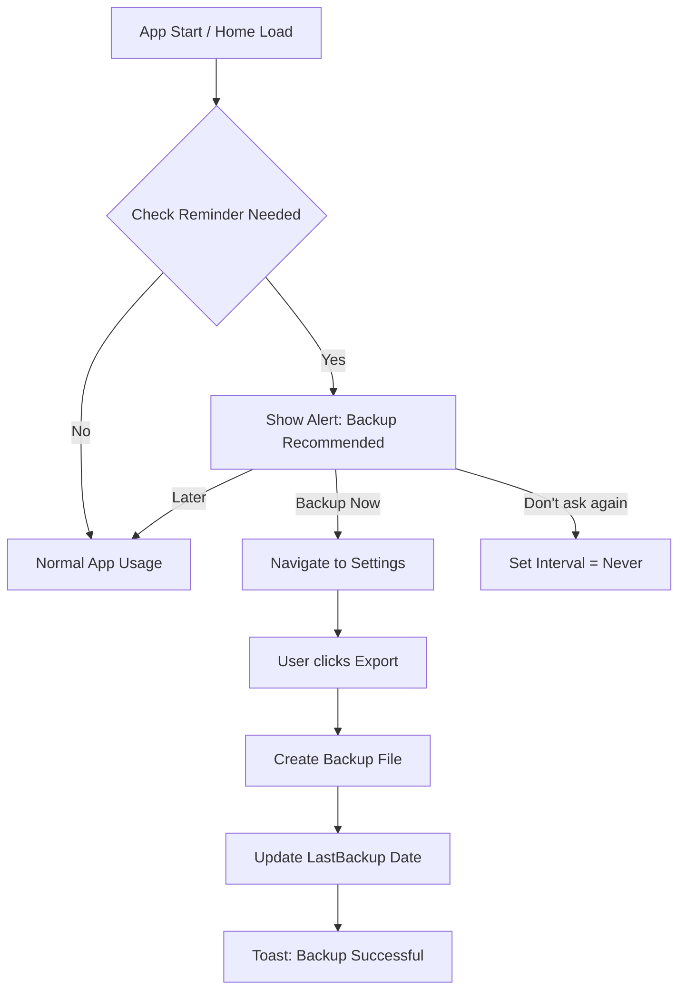

# Backup Reminder Plan

## Status Quo
- App ist eine PWA/Capacitor App ohne eigenes Backend.
- Daten liegen nur im `localStorage`.
- Nutzer verlieren Daten, wenn sie Cache leeren oder Gerät wechseln/verlieren.
- Bisher gibt es manuelle Export/Import Funktionen.

## Ziel
Nutzer sollen regelmäßig daran erinnert werden, ein Backup zu erstellen, da kein automatischer Cloud-Sync existiert.

## Architektur-Anpassungen

### 1. StorageService Erweiterung (`src/services/StorageService.ts`)
Wir müssen speichern, wann das letzte Backup erstellt wurde und wie oft der Nutzer erinnert werden möchte.

```typescript
const KEYS = {
  // ... existing
  LAST_BACKUP: 'seifenrechner_last_backup', // Timestamp string
  BACKUP_INTERVAL: 'seifenrechner_backup_interval' // 'never', 'weekly', 'monthly'
};

// Neue Methoden:
// - getLastBackupDate(): Date | null
// - saveLastBackupDate(date: Date): void
// - getBackupReminderInterval(): BackupInterval
// - saveBackupReminderInterval(interval: BackupInterval): void
```

### 2. Neuer Hook `useBackupReminder` (`src/hooks/useBackupReminder.ts`)
Kapselt die Logik zur Prüfung, ob eine Erinnerung fällig ist.

```typescript
export const useBackupReminder = () => {
    // Liefert true zurück, wenn:
    // - Intervall != 'never'
    // - UND (LastBackup == null ODER (Jetzt - LastBackup) > Intervall)
    const shouldRemind = (): boolean => { ... }
    
    // Hilfsfunktionen für UI Texte ("Letztes Backup: vor 3 Tagen")
    const getLastBackupText = (): string => { ... }
    
    return { shouldRemind, getLastBackupText };
}
```

### 3. Settings UI (`src/pages/Settings.tsx`)
- Neue Sektion für "Sicherung".
- Dropdown für Intervall (Wöchentlich, Monatlich, Nie).
- Anzeige: "Letztes Backup: [Datum]".
- Export-Button Logik erweitern: Nach erfolgreichem Export `saveLastBackupDate(new Date())` aufrufen.

### 4. App-Start Prüfung (`src/pages/Home.tsx` oder `App.tsx`)
- Beim Laden der Home-Seite `useEffect` nutzen.
- `shouldRemind()` prüfen.
- Wenn `true`: `IonAlert` anzeigen.
    - "Sicherung empfohlen: Dein letztes Backup ist lange her."
    - Buttons: "Jetzt sichern" (Navigiert zu Settings), "Später", "Nicht mehr erinnern" (Setzt Intervall auf 'never' oder snoozed).

## Flow Diagram



## Offene Punkte / Überlegungen
- **Native Share:** Unter iOS ist der Download-Link manchmal UX-technisch schwach (speichert in "Dateien" unter "Downloads"). `@capacitor/share` könnte den nativen Share-Dialog öffnen (AirDrop, Mail, Drive, etc.).
  - *Entscheidung:* Vorerst bei Download bleiben, da einfacher zu testen und universell für PWA. Später als Enhancement.
- **Snooze:** "Später erinnern" sollte nicht bei jedem App-Start nerven, sondern vielleicht erst am nächsten Tag wieder.
  - *Vereinfachung MVP:* Wir prüfen einfach stur gegen das Intervall. Wenn Intervall = 1 Woche und letztes Backup > 1 Woche, kommt die Meldung. Wenn Nutzer "Später" klickt, kommt sie beim nächsten App-Start wieder (oder man merkt sich "Session Snooze").
  - *Lösung:* Session Storage nutzen für "Snooze this session", damit es nicht bei jedem Page-Reload nervt.

## Todo List
1. `StorageService` anpassen.
2. `useBackupReminder` Hook erstellen.
3. `Settings` Page UI erweitern und Export-Handler updaten.
4. `Home` Page Alert Integration.
